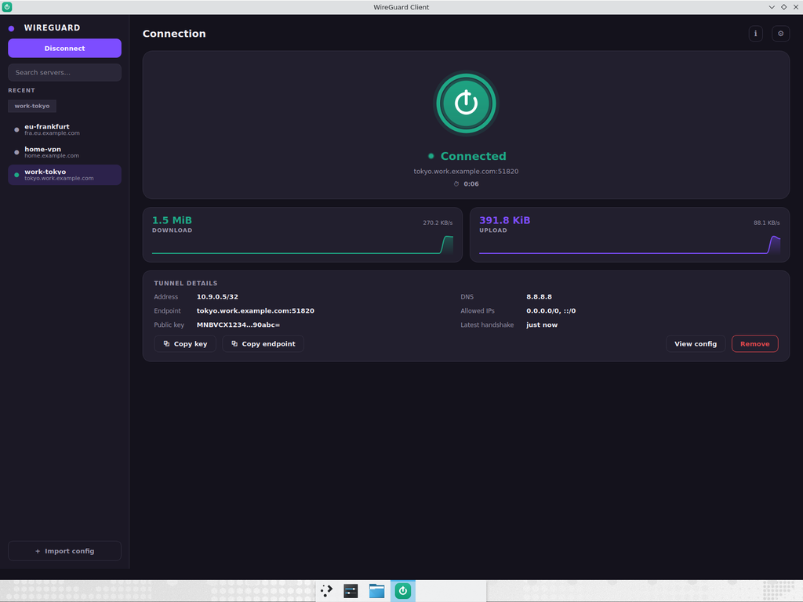

# WireGuard Client

A clean WireGuard client GUI. Import your existing `.conf` files and connect /
disconnect with one click. Packs into a single `.exe` for Windows.



## Features

- Two-pane layout: searchable server list on the left, live connection
  dashboard on the right.
- **Quick Connect** and one-click connect / disconnect.
- Connection stats: live duration timer, download / upload counters.
- Full tunnel details: address, DNS, endpoint, allowed IPs, public key,
  latest handshake.
- **View config** (raw `.conf` with the private key masked).
- **Settings**: dark / light theme (persisted), connect-on-launch,
  minimize-to-tray.
- System tray icon (connect / disconnect / show / quit).
- Single-file Windows executable (no installer for the GUI itself).

## Requirements

- **WireGuard for Windows** must be installed (the app drives its
  `wireguard.exe`): <https://www.wireguard.com/install/>
- The app requests administrator rights, which WireGuard needs to start/stop
  tunnel services.

## Run from source

```bash
pip install -r requirements.txt
python run.py
```

> On Linux/macOS the GUI runs for previewing the layout, but tunnels can only
> be started on Windows (where `wireguard.exe` is available).

## Build the single-file exe (on Windows)

```bat
build_windows.bat
```

The executable is written to `dist\WireGuardClient.exe`. Internally this runs:

```bat
pip install -r requirements.txt pyinstaller
pyinstaller wireguard-client.spec
```

## How it works

| Action      | Command                                             |
| ----------- | --------------------------------------------------- |
| Connect     | `wireguard.exe /installtunnelservice <name>.conf`   |
| Disconnect  | `wireguard.exe /uninstalltunnelservice <name>`      |
| Status      | `wg.exe show <name> dump`                           |

Imported configs are copied to `%APPDATA%\WireGuardClient\tunnels` so the GUI
keeps a stable copy that the tunnel service references. Preferences are stored
in `%APPDATA%\WireGuardClient\settings.json` (`~/.config/WireGuardClient` on
Linux/macOS).
